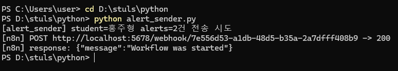
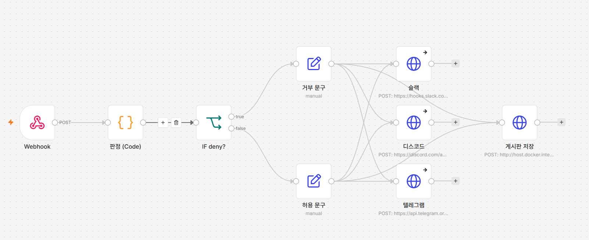
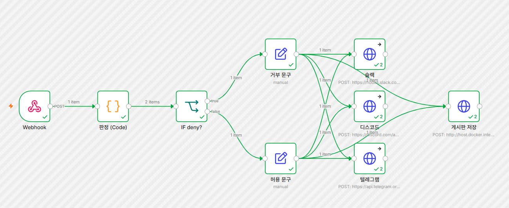
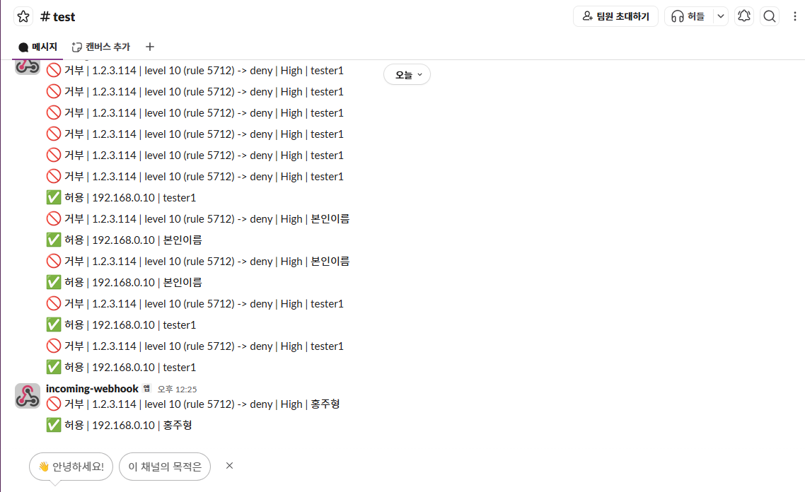
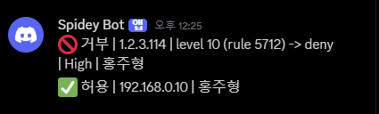
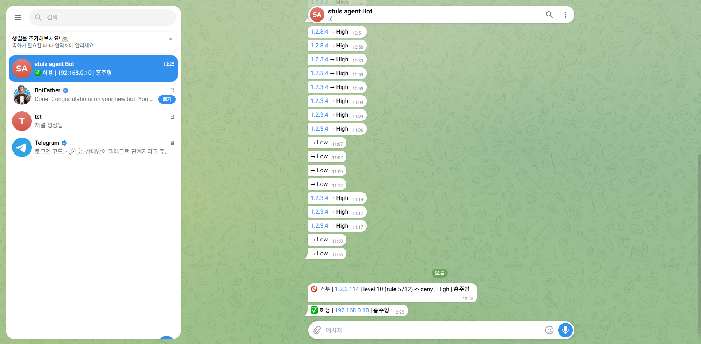
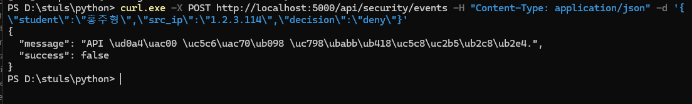
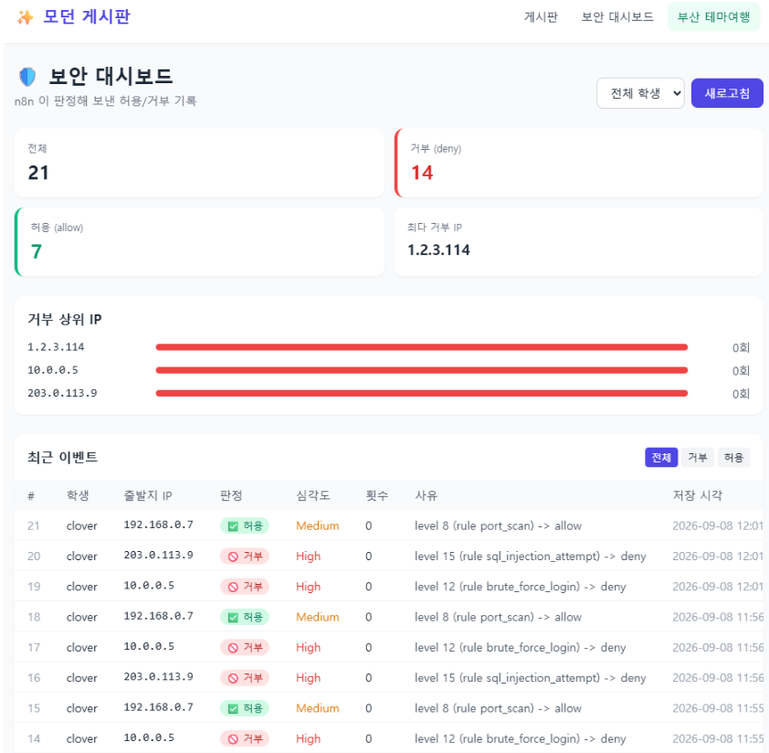
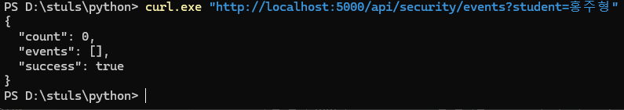
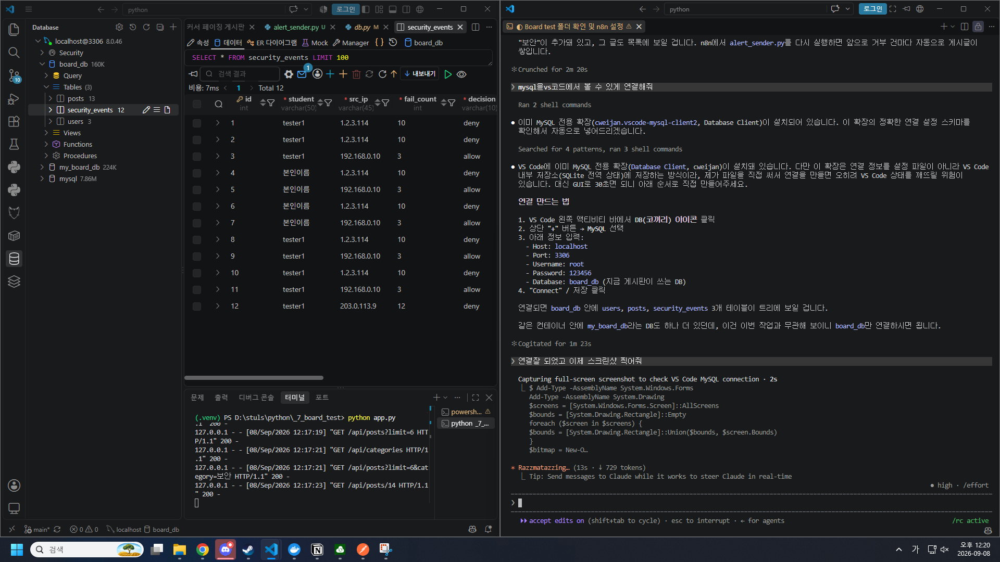

# 로그인 경보 자동화 봇 (n8n SOAR)

## ① 무엇을 만들었나

파이썬이 보낸 로그인 경보(레벨)를 **n8n**이 스스로 허용/거부로 판정해서, **슬랙·디스코드·텔레그램**
3곳에 알리고, **Flask 게시판(REST API)**을 통해 **MySQL**에 기록하는 자동화 봇입니다.
거부 이벤트는 게시판에 "보안" 공지글로도 자동 등록되고, 별도 **보안 대시보드** 페이지에서
전체 현황을 한눈에 볼 수 있습니다.

> 이 봇이 올라가 있는 **Flask 게시판 자체의 상세 문서**(API 명세, 커서 페이징, JWT 인증)는
> [README_board.md](README_board.md)를 참고하세요.

## ② 작업 내역

| 순서 | 한 일 | 사용한 것 |
|---|---|---|
| 1 | 기존 Flask 게시판(`_7_board_test`)에 `security_events` 테이블과 `POST/GET /api/security/events` REST API 추가 | Python, Flask, PyMySQL, MySQL |
| 2 | `alert_sender.py` 작성 — 경보 2건(레벨 10 이상 1건 + 미만 1건)을 n8n Webhook으로 전송 | Python, requests |
| 3 | n8n 워크플로우 구성: `Webhook → Code(판정) → IF(deny?) → 문구 생성 → 슬랙·디스코드·텔레그램 알림 + 게시판 저장 REST 호출` | n8n, JavaScript |
| 4 | 거부(deny)·허용(allow) 이벤트를 게시판에 "보안" 카테고리 공지글로 자동 등록 | Flask, MySQL |
| 5 | 보안 대시보드(`/dashboard`) 페이지 추가 — 허용/거부 건수, 거부 상위 IP, 최근 이벤트 테이블 | Flask, Tailwind CSS |

**판정 규칙** (n8n Code 노드): `level ≥ 10` → `High/deny`, `level ≥ 7` → `Medium/allow`, 그 외 → `Low/allow`

## ③ 기능 구현 화면

**파이썬 전송기 실행 — n8n 응답 200**


**n8n 워크플로우 구조** (Webhook → 판정 → IF → 문구 → 슬랙/디스코드/텔레그램 + 게시판 저장)


**n8n 실행 성공** — 전체 노드가 초록으로 실행 완료 (거부·허용 각 1건씩, 노드마다 2회 실행)


**슬랙 알림 도착**


**디스코드 알림 도착**


**텔레그램 알림 도착**


**API 키 없이 요청 → 401 (fail-closed 인증)**


**보안 대시보드 (`/dashboard`)** — 전체/허용/거부 집계, 최다 거부 IP, 거부 상위 IP 막대, 최근 이벤트 테이블


**저장된 이벤트 조회 (GET /api/security/events)**


**MySQL에 저장된 security_events 테이블**


## ④ 실행 방법

① **켜는 것**: Docker Desktop 실행 → MySQL·n8n 컨테이너 기동 → `_7_board_test` 폴더에서 `.env.example`을
   `.env`로 복사하고 값 채우기 → `pip install -r _7_board_test/requirements.txt`

② **실행하는 것**:
```bash
cd _7_board_test && python app.py      # 게시판 서버 (포트 5000)
```
n8n(`localhost:5678`)에서 워크플로우를 Import 후 활성화(Active) → Webhook URL을 `alert_sender.py`의
`N8N_WEBHOOK_URL`에 넣고 `python alert_sender.py` 실행

③ **통과 화면**: 터미널에 `-> 200` 출력 → n8n Executions에서 전체 노드 초록 → 슬랙/디스코드/텔레그램에
   거부·허용 메시지 도착 → MySQL `security_events`에 새 행 추가 + 게시판에 "[보안]" 공지글 등록 →
   `http://localhost:5000/dashboard`에서 집계 확인

④ **안 될 때 보는 곳**: n8n 좌측 Executions 탭에서 빨간 노드 클릭 → 에러 메시지 확인 / Flask 콘솔 로그 /
   `docker logs n8n`

## ⑤ 막혔던 점과 해결 방법

1. **게시판 저장이 계속 400 났던 문제** — 슬랙 노드 뒤에 게시판 저장 노드를 바로 이어붙였더니, 슬랙의
   응답(`{"data":"ok"}`)이 다음 노드의 입력을 덮어써서 `student`·`src_ip` 같은 원본 값이 사라졌던 것이
   원인이었다. "문구" 노드에서 메신저 3곳과 게시판 저장 노드로 동시에(병렬로) 분기하도록 연결을 바꿔서
   해결했다.

2. **Code 노드 언어 함정** — n8n Code 노드에서 언어를 Python(Beta)으로 선택하면 실행이 즉시 실패한다.
   이 n8n 컨테이너에는 Python 런타임 자체가 설치돼 있지 않기 때문이다(`docker logs n8n`에
   `Failed to start Python task runner... Python 3 is missing`으로 확인). 언어를 JavaScript로 선택해서
   해결했다.

3. **텔레그램만 유독 실패하는 문제** — 알고 보니 429(Too Many Requests) 에러였다. 같은 봇으로 짧은 시간에
   여러 번 테스트해서 생긴 일시적 rate limit이었다. 메신저 노드에 "실패해도 계속 진행"
   (`continueRegularOutput`) 옵션을 켜서, 메신저 하나가 실패해도 게시판 저장까지는 반드시 실행되게
   만들었다.

## 안전 관련 안내

- `.env`는 `.gitignore`에 등록되어 있으며, 실제 값 없는 `_7_board_test/.env.example`만 포함합니다.
- 슬랙/디스코드 Webhook URL, 텔레그램 봇 토큰, `SECURITY_API_KEY`는 이 저장소 어디에도 원문으로
  포함되어 있지 않습니다.
